# anicli-ru
___
Скрипт для поиска и просмотра аниме из терминала с русской озвучкой для linux систем, написанный на python.

Парсит аниме со сторонних сайтов, которые отношения к разработчику скрипта не имеют.



___
# Supported video hostings:
* sibnet
* aniboom
* kodik
---
# Dependencies:
* mpv
* ffmpeg (опционально, для скачивания видео через аргумент "**-d**")
* python 3.7+
* pip
* requests
___
# Install:
**CLI tool:**
```
git clone https://github.com/vypivshiy/ani-cli-ru.git
cd ani-cli-ru
sudo make
```
**Если нужен только доступ к API интерфейсу программы без установки CLI скрипта:**
```
git clone https://github.com/vypivshiy/ani-cli-ru.git
cd ani-cli-ru
python3 setup.py install
```
Или

`python3 -m pip install anicli-ru`
___
# Usage:
`anicli-ru`
___
# CLI Commands:
```
q [q]uit - выход из программы
b [b]ack to the previous step - возвратиться на предыдущий шаг
h [h]elp - вывод списка доступных команд
c [c]lear - очистить консоль
o [o]ngoing - напечатать недавно вышедшие онгоинги
```
# Optional arguments:
**-p --proxy** - опциональный аргумент на установку прокси. Если просмотр аниме (или некоторых тайтлов) 
запрещен в вашей стране, то это поможет обойти ограничения. (Только на получение прямой ссылки на видео, 
сама загрузка видео будет идти без прокси. Как правило, на просмотр видео по прямой ссылке ограничений нет)

Пример ввода прокси:
    
    anicli-ru --proxy https://192.168.0.1:8080  # HTTPS
    
    anicli-ru --proxy socks4://192.168.0.1:8888  # SOCKS4
    
    anicli-ru --proxy socks5://192.168.0.1:8888  # SOCKS5

**-q --quality** - качество видео. Доступные значения: 360,480,720 По умолчанию 720. Работает __только__ на kodik

**-d --download** - режим скачивания видео. Требуется ffmpeg. По умолчанию False

**-i --instant** - режим просмотра эпизодов пока они не закончатся. Удобно, если хотите посмотреть полностью 
тайтл, не переключая эпизоды вручную. По умолчанию False

**-s --source** - источник парсинга тайтлов. Доступные значения [1,2] 1 - animego, 2 - animania. Добавить этот флаг 
если нет доступа к одному из источников. По умолчанию animego
---
# FAQ
Q: У меня скрипт ничего не находит

A: Изначальный сайт, на котором задумывалось парсить данные, при высоких нагрузках **времененно** включают cloudflare и из-за него скрипт ломается. 
Эксперименты по его обходу провалились, поэтому добавлен резервный парсер со стороннего сайта.

Запустите скрипт с параметром `-s 2`, чтобы сменить на другой источник.

---
# Api quickstart example
```python
from anicli_ru import Anime

a = Anime()
ongoings = a.ongoing()  # get ongoings
results = a.search("experiments lain")  # search anime
episodes = results[0].episodes()  # get episodes
players = episodes[0].player()  # get first dub episode
print(players[0].get_video())  # get direct video url
```
# Roadmap:

- [x] добавить поддержку proxy;
- [x] вывод вышедших на сегодняшнюю дату онгоингов;
- [x] добавить дополнительный источник (если один из каких то не будет работать)
- [x] выбор качества видео;
- [x] добавить дополнительные опициональные аргументы;
- [ ] рефакторинг логики работы меню;
